# Bilibili Pure APK — Class Diagram

Total: 19 Kotlin source files, 35 classes/interfaces/objects/data classes.

---

## 1. Package Hierarchy

```
com.bilibili.pure
├── BilibiliApp.kt
├── MainActivity.kt
├── data/
│   ├── model/
│   │   └── Models.kt
│   ├── api/
│   │   ├── BilibiliApi.kt
│   │   └── PassportApi.kt
│   └── repository/
│       └── BilibiliRepository.kt
└── ui/
    ├── theme/
    │   └── Theme.kt
    ├── navigation/
    │   └── Navigation.kt
    ├── search/
    │   ├── SearchScreen.kt
    │   └── SearchViewModel.kt
    ├── detail/
    │   ├── DetailScreen.kt
    │   └── DetailViewModel.kt
    ├── player/
    │   ├── PlayerScreen.kt
    │   ├── PlayerViewModel.kt
    │   └── SpeedController.kt
    ├── login/
    │   ├── LoginScreen.kt
    │   ├── LoginViewModel.kt
    │   └── PasswordLoginContent.kt
    └── profile/
        └── ProfileScreen.kt
```

---

## 2. Inheritance Hierarchy

```
Any
 ├── Application
 │   └── BilibiliApp  (implements ImageLoaderFactory)
 ├── ComponentActivity
 │   └── MainActivity
 ├── ViewModel
 │   ├── SearchViewModel
 │   ├── DetailViewModel
 │   └── PlayerViewModel
 ├── AndroidViewModel
 │   └── LoginViewModel
 └── SpeedController  (standalone)

Screen (sealed)
 ├── Screen.Search
 └── Screen.Profile

LoginUiState (sealed)
 ├── LoginUiState.Idle
 ├── LoginUiState.Loading
 ├── LoginUiState.QRReady
 ├── LoginUiState.Scanned
 ├── LoginUiState.Expired
 ├── LoginUiState.Success
 └── LoginUiState.Error
```

---

## 3. Composition Relationships (class A holds class B as field)

| Owner | Field Name | Field Type | Source |
|-------|-----------|------------|--------|
| `BilibiliRepository` | `api` | `BilibiliApi` | constructor parameter |
| `BilibiliRepository` | `passportApi` | `PassportApi` | constructor parameter |
| `SearchViewModel` | `repository` | `BilibiliRepository` | constructor parameter |
| `DetailViewModel` | `repository` | `BilibiliRepository` | constructor parameter |
| `PlayerViewModel` | `repository` | `BilibiliRepository` | constructor parameter |
| `LoginViewModel` | `repository` | `BilibiliRepository` | field init |
| `SpeedController` | `player` | `Player` (Media3) | constructor parameter |
| `PlayerScreen` | `player` | `ExoPlayer` | local `remember` |
| `PlayerScreen` | `speedCtl` | `SpeedController` | local `remember` |
| `PlayerContent` | `speedCtl` | `SpeedController` | function parameter |
| `SearchScreen` | `viewModel` | `SearchViewModel` | composable param |
| `DetailScreen` | `viewModel` | `DetailViewModel` | composable param |
| `PlayerScreen` | `vm` | `PlayerViewModel` | composable param |
| `LoginScreen` | `viewModel` | `LoginViewModel` | composable param |

---

## 4. Package Dependency Graph

```mermaid
graph TD
    subgraph ui
        MainActivity --> SearchScreen
        MainActivity --> DetailScreen
        MainActivity --> PlayerScreen
        MainActivity --> LoginScreen
        MainActivity --> ProfileScreen
        MainActivity --> Screen
        MainActivity --> Routes

        SearchScreen --> SearchViewModel
        SearchScreen --> SearchVideoItem

        DetailScreen --> DetailViewModel
        DetailScreen --> VideoInfo
        DetailScreen --> CommentItem

        PlayerScreen --> PlayerViewModel
        PlayerScreen --> SpeedController
        PlayerScreen --> BilibiliApi

        LoginScreen --> LoginViewModel
        LoginScreen --> PasswordLoginContent

        PasswordLoginContent --> BilibiliApi
        ProfileScreen --> BilibiliApi
    end

    subgraph data.repository
        BilibiliRepository
    end

    subgraph data.api
        BilibiliApi
        PassportApi
    end

    subgraph data.model
        ApiResponse
        SearchResult
        SearchVideoItem
        VideoInfo
        VideoPage
        VideoOwner
        VideoStat
        CommentList
        CommentItem
        PlayUrlInfo
        DurlItem
        QRLoginData
        QRPollData
    end

    BilibiliRepository --> BilibiliApi
    BilibiliRepository --> PassportApi
    BilibiliRepository --> ApiResponse
    BilibiliRepository --> SearchVideoItem
    BilibiliRepository --> VideoInfo
    BilibiliRepository --> PlayUrlInfo
    BilibiliRepository --> CommentList
    BilibiliRepository --> QRLoginData
    BilibiliRepository --> QRPollData

    SearchViewModel --> BilibiliRepository
    SearchViewModel --> SearchVideoItem
    DetailViewModel --> BilibiliRepository
    DetailViewModel --> VideoInfo
    DetailViewModel --> CommentItem
    PlayerViewModel --> BilibiliRepository
    PlayerViewModel --> VideoInfo
    PlayerViewModel --> VideoPage
    LoginViewModel --> BilibiliRepository
    LoginViewModel --> BilibiliApi

    PassportApi --> BilibiliApi
    BilibiliApp --> BilibiliApi
    BilibiliApp --> BilibiliApi.httpClient

    DetailScreen --> formatCount("ui.search.formatCount")
```



**Dependency direction:** `ui → data.repository → data.api → data.model`

---

## 5. File-by-File Class Details

### `com.bilibili.pure`

| File | Defined Type | Kind | Superclass | Interfaces | Holds |
|------|-------------|------|------------|------------|-------|
| `BilibiliApp.kt` | `BilibiliApp` | class | `Application` | `ImageLoaderFactory` | `BilibiliApi.httpClient` |
| `BilibiliApp.kt` | `BilibiliApp.Companion` | companion | — | — | `TAG` |
| `MainActivity.kt` | `MainActivity` | class | `ComponentActivity` | — | — |

### `com.bilibili.pure.data.model`

| File | Defined Type | Kind | Superclass | Interfaces | Holds |
|------|-------------|------|------------|------------|-------|
| `Models.kt` | `ApiResponse<T>` | data class | — | — | generic `T` |
| `Models.kt` | `SearchResult` | data class | — | — | `SearchVideoItem` |
| `Models.kt` | `SearchVideoItem` | data class | — | — | — |
| `Models.kt` | `VideoInfo` | data class | — | — | `VideoOwner`, `VideoStat`, `VideoPage` |
| `Models.kt` | `VideoOwner` | data class | — | — | — |
| `Models.kt` | `VideoStat` | data class | — | — | — |
| `Models.kt` | `VideoPage` | data class | — | — | — |
| `Models.kt` | `CommentList` | data class | — | — | `CommentItem`, `CommentCursor` |
| `Models.kt` | `CommentItem` | data class | — | — | `CommentContent`, `CommentMember` |
| `Models.kt` | `CommentContent` | data class | — | — | — |
| `Models.kt` | `CommentMember` | data class | — | — | — |
| `Models.kt` | `CommentCursor` | data class | — | — | — |
| `Models.kt` | `PlayUrlInfo` | data class | — | — | `DurlItem` |
| `Models.kt` | `DurlItem` | data class | — | — | — |
| `Models.kt` | `QRLoginData` | data class | — | — | — |
| `Models.kt` | `QRPollData` | data class | — | — | — |

### `com.bilibili.pure.data.api`

| File | Defined Type | Kind | Superclass | Interfaces | Holds |
|------|-------------|------|------------|------------|-------|
| `BilibiliApi.kt` | `BilibiliApi` | interface | — | — | — |
| `BilibiliApi.kt` | `BilibiliApi.Companion` | companion | — | — | `httpClient`, `buvid3`, `loginCookies` |
| `PassportApi.kt` | `PassportApi` | interface | — | — | — |
| `PassportApi.kt` | `PassportApi.Companion` | companion | — | — | `BilibiliApi.httpClient` |

### `com.bilibili.pure.data.repository`

| File | Defined Type | Kind | Superclass | Interfaces | Holds |
|------|-------------|------|------------|------------|-------|
| `BilibiliRepository.kt` | `BilibiliRepository` | class | — | — | `BilibiliApi`, `PassportApi` |

### `com.bilibili.pure.ui.theme`

| File | Defined Type | Kind |
|------|-------------|------|
| `Theme.kt` | `BilibiliPureTheme` | top-level function |

### `com.bilibili.pure.ui.navigation`

| File | Defined Type | Kind | Superclass | Holds |
|------|-------------|------|------------|-------|
| `Navigation.kt` | `Screen` | sealed class | — | `route`, `label`, `icon` |
| `Navigation.kt` | `Screen.Search` | data object | `Screen` | — |
| `Navigation.kt` | `Screen.Profile` | data object | `Screen` | — |
| `Navigation.kt` | `Routes` | object | — | route string consts + builder functions |
| `Navigation.kt` | `bottomNavItems` | top-level val | — | `List<Screen>` |

### `com.bilibili.pure.ui.search`

| File | Defined Type | Kind | Superclass | Holds |
|------|-------------|------|------------|-------|
| `SearchViewModel.kt` | `SearchSortOption` | data class | — | `value`, `label` |
| `SearchViewModel.kt` | `SearchSort` | object | — | `options: List<SearchSortOption>` |
| `SearchViewModel.kt` | `SearchUiState` | data class | — | `SearchVideoItem`, `SearchSortOption` |
| `SearchViewModel.kt` | `SearchViewModel` | class | `ViewModel` | `BilibiliRepository` |
| `SearchScreen.kt` | `SearchScreen` | top-level function | — | takes `SearchViewModel` |
| `SearchScreen.kt` | `SortSelector` | top-level function | — | takes `SearchSortOption` |
| `SearchScreen.kt` | `SearchVideoCard` | top-level function | — | takes `SearchVideoItem` |
| `SearchScreen.kt` | `formatCount` | top-level function | — | — |

### `com.bilibili.pure.ui.detail`

| File | Defined Type | Kind | Superclass | Holds |
|------|-------------|------|------------|-------|
| `DetailViewModel.kt` | `ReplyThread` | data class | — | `CommentItem` |
| `DetailViewModel.kt` | `DetailUiState` | data class | — | `VideoInfo`, `CommentItem`, `ReplyThread` |
| `DetailViewModel.kt` | `DetailViewModel` | class | `ViewModel` | `BilibiliRepository` |
| `DetailScreen.kt` | `DetailScreen` | top-level function | — | takes `DetailViewModel` |
| `DetailScreen.kt` | `DetailContent` | top-level function | — | takes `VideoInfo`, `CommentItem` |
| `DetailScreen.kt` | `CommentCard` | top-level function | — | takes `CommentItem` |
| `DetailScreen.kt` | `ReplyRow` | top-level function | — | takes `CommentItem` |
| `DetailScreen.kt` | `StatChip` | top-level function | — | — |

### `com.bilibili.pure.ui.player`

| File | Defined Type | Kind | Superclass | Holds |
|------|-------------|------|------------|-------|
| `PlayerViewModel.kt` | `PlayerUiState` | data class | — | `VideoInfo`, `VideoPage` |
| `PlayerViewModel.kt` | `PlayerViewModel` | class | `ViewModel` | `BilibiliRepository` |
| `PlayerScreen.kt` | `PlayerScreen` | top-level function | — | takes `PlayerViewModel`; creates `ExoPlayer`, `SpeedController` |
| `PlayerScreen.kt` | `PlayerContent` | top-level function | — | takes `SpeedController`, `PlayerUiState` |
| `SpeedController.kt` | `SpeedController` | class | — | holds `Player` (Media3) |

### `com.bilibili.pure.ui.login`

| File | Defined Type | Kind | Superclass | Holds |
|------|-------------|------|------------|-------|
| `LoginViewModel.kt` | `LoginUiState` | sealed class | — | subclasses below |
| `LoginViewModel.kt` | `LoginUiState.Idle` | data object | `LoginUiState` | — |
| `LoginViewModel.kt` | `LoginUiState.Loading` | data object | `LoginUiState` | — |
| `LoginViewModel.kt` | `LoginUiState.QRReady` | data class | `LoginUiState` | `url`, `key` |
| `LoginViewModel.kt` | `LoginUiState.Scanned` | data object | `LoginUiState` | — |
| `LoginViewModel.kt` | `LoginUiState.Expired` | data object | `LoginUiState` | — |
| `LoginViewModel.kt` | `LoginUiState.Success` | data object | `LoginUiState` | — |
| `LoginViewModel.kt` | `LoginUiState.Error` | data class | `LoginUiState` | `message` |
| `LoginViewModel.kt` | `LoginViewModel` | class | `AndroidViewModel` | `BilibiliRepository` |
| `LoginScreen.kt` | `LoginScreen` | top-level function | — | takes `LoginViewModel` |
| `LoginScreen.kt` | `QrImage` | top-level function | — | — |
| `LoginScreen.kt` | `generateQrBitmap` | top-level function | — | — |
| `PasswordLoginContent.kt` | `PasswordLoginContent` | top-level function | — | calls `BilibiliApi.setLoginCookies()` |

### `com.bilibili.pure.ui.profile`

| File | Defined Type | Kind | Superclass | Holds |
|------|-------------|------|------------|-------|
| `ProfileScreen.kt` | `ProfileScreen` | top-level function | — | calls `BilibiliApi.loginCookies` |

---

## 6. Notable Cross-Package Function Call

```
DetailScreen.kt  ──imports──>  com.bilibili.pure.ui.search.formatCount
```

This is the only reverse-package dependency (detail → search). Consider moving `formatCount` to a shared utility.

---

## 7. Key Data Flow

```
SearchScreen ──onVideoClick(bvid)──> DetailScreen ──onPlay(bvid)──> PlayerScreen
LoginScreen  ──onLoginSuccess──────> ProfileScreen (refresh)

BilibiliRepository ────────────> ViewModels (via Result<T>)
        │
        ├── BilibiliApi ──> api.bilibili.com (search/detail/playurl/comment)
        └── PassportApi ──> passport.bilibili.com (QR login)
```
